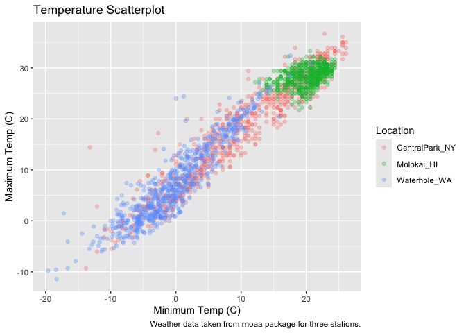
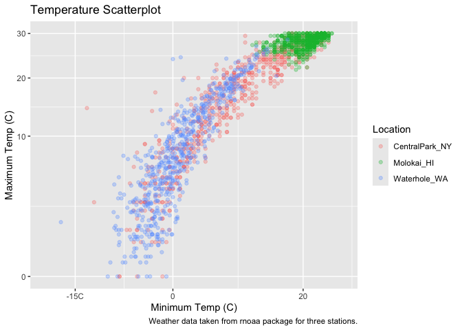
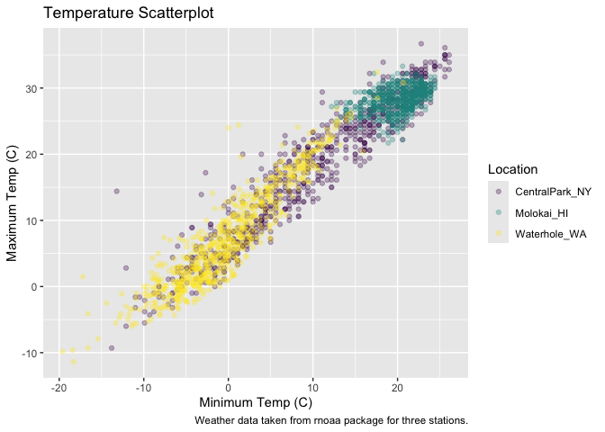
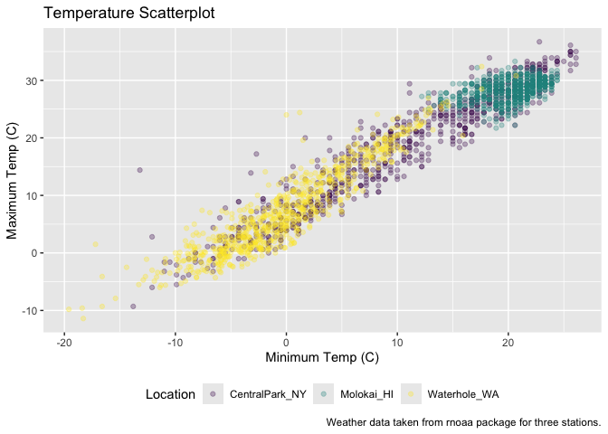
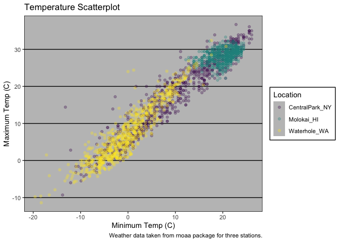
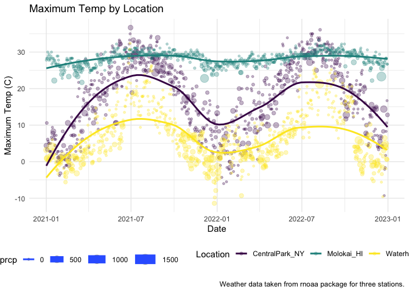
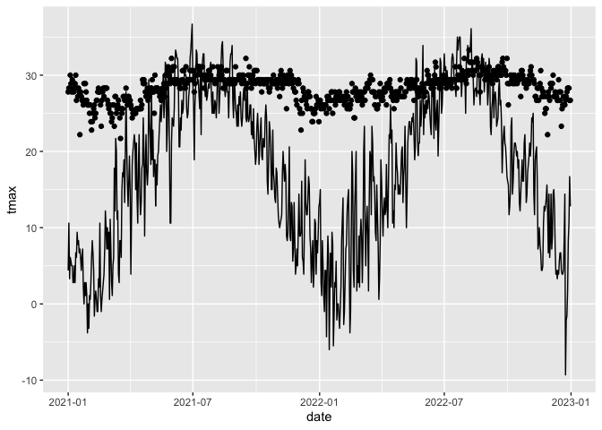
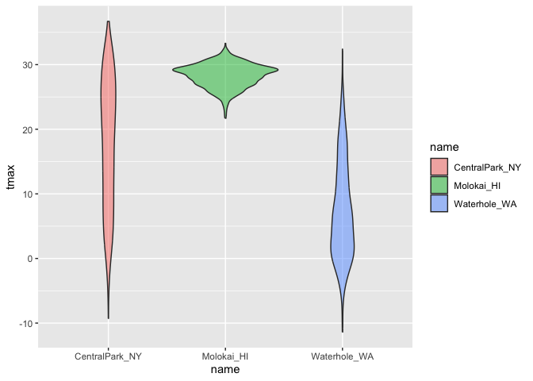

visualization1
================
Rebecca Shyu
2024-09-26

## R Markdown

``` r
weather_df = 
  rnoaa::meteo_pull_monitors(
    c("USW00094728", "USW00022534", "USS0023B17S"),
    var = c("PRCP", "TMIN", "TMAX"), 
    date_min = "2021-01-01",
    date_max = "2022-12-31") |>
  mutate(
    name = case_match(
      id, 
      "USW00094728" ~ "CentralPark_NY", 
      "USW00022534" ~ "Molokai_HI",
      "USS0023B17S" ~ "Waterhole_WA"),
    tmin = tmin / 10,
    tmax = tmax / 10) |>
  select(name, id, everything())
```

    ## using cached file: /Users/rebeccashyu/Library/Caches/org.R-project.R/R/rnoaa/noaa_ghcnd/USW00094728.dly

    ## date created (size, mb): 2024-09-26 10:04:40.134681 (8.651)

    ## file min/max dates: 1869-01-01 / 2024-09-30

    ## using cached file: /Users/rebeccashyu/Library/Caches/org.R-project.R/R/rnoaa/noaa_ghcnd/USW00022534.dly

    ## date created (size, mb): 2024-09-26 10:19:49.816428 (3.932)

    ## file min/max dates: 1949-10-01 / 2024-09-30

    ## using cached file: /Users/rebeccashyu/Library/Caches/org.R-project.R/R/rnoaa/noaa_ghcnd/USS0023B17S.dly

    ## date created (size, mb): 2024-09-26 10:19:51.679842 (1.036)

    ## file min/max dates: 1999-09-01 / 2024-09-30

Make a scatterplot but fancy this time

``` r
weather_df %>% 
  ggplot(aes(x = tmin, y = tmax, color = name)) +
  geom_point(alpha = 0.3) +
  labs(
    title = "Temperature Scatterplot",
    x= "Minimum Temp (C)",
    y= "Maximum Temp (C)",
    color = "Location",
    caption = "Weather data taken from rnoaa package for three stations."
  )
```

    ## Warning: Removed 17 rows containing missing values or values outside the scale range
    ## (`geom_point()`).

<!-- -->

``` r
weather_df %>% 
  ggplot(aes(x = tmin, y = tmax, color = name)) +
  geom_point(alpha = 0.3) +
  labs(
    title = "Temperature Scatterplot",
    x= "Minimum Temp (C)",
    y= "Maximum Temp (C)",
    color = "Location",
    caption = "Weather data taken from rnoaa package for three stations."
  ) +
  scale_x_continuous(
    breaks = c(-15, 0, 20),
    labels = c("-15C", "0", "20")
  ) +
  scale_y_continuous(
    limits = c(0, 30),
    transform = "sqrt"
  )
```

    ## Warning in transformation$transform(x): NaNs produced

    ## Warning in scale_y_continuous(limits = c(0, 30), transform = "sqrt"): sqrt
    ## transformation introduced infinite values.

    ## Warning: Removed 302 rows containing missing values or values outside the scale range
    ## (`geom_point()`).

<!-- -->

Look at color - use viridis

``` r
weather_df %>% 
  ggplot(aes(x = tmin, y = tmax, color = name)) +
  geom_point(alpha = 0.3) +
  labs(
    title = "Temperature Scatterplot",
    x= "Minimum Temp (C)",
    y= "Maximum Temp (C)",
    color = "Location",
    caption = "Weather data taken from rnoaa package for three stations."
  ) +
  viridis::scale_color_viridis(discrete=TRUE)
```

    ## Warning: Removed 17 rows containing missing values or values outside the scale range
    ## (`geom_point()`).

<!-- -->

## Themes

``` r
ggp_scatterplot = 
  weather_df %>% 
  ggplot(aes(x = tmin, y = tmax, color = name)) +
  geom_point(alpha = 0.3) +
  labs(
    title = "Temperature Scatterplot",
    x= "Minimum Temp (C)",
    y= "Maximum Temp (C)",
    color = "Location",
    caption = "Weather data taken from rnoaa package for three stations."
  ) +
  viridis::scale_color_viridis(discrete=TRUE)
```

``` r
ggp_scatterplot +
  theme(legend.position = "bottom")
```

    ## Warning: Removed 17 rows containing missing values or values outside the scale range
    ## (`geom_point()`).

<!-- -->

``` r
ggp_scatterplot +
  theme_bw() + # this will reset the bottom if it's after it
  theme(legend.position = "bottom")
```

    ## Warning: Removed 17 rows containing missing values or values outside the scale range
    ## (`geom_point()`).

<!-- -->

``` r
ggp_scatterplot +
  theme(legend.position = "bottom") +
  ggthemes::theme_excel()
```

    ## Warning: Removed 17 rows containing missing values or values outside the scale range
    ## (`geom_point()`).

<!-- -->

Learning Assessment

``` r
la_weather = 
  weather_df %>% 
  ggplot(aes(x = date, y = tmax, color = name, size = prcp)) +
  geom_point(alpha = 0.3) +
  geom_smooth(se = FALSE) +
  viridis::scale_color_viridis(discrete=TRUE) +
  labs(
    title = "Maximum Temp by Location",
    x= "Date",
    y= "Maximum Temp (C)",
    color = "Location",
    caption = "Weather data taken from rnoaa package for three stations."
  ) +
  theme_minimal() +
  theme(legend.position = "bottom")

la_weather
```

    ## Warning: Using `size` aesthetic for lines was deprecated in ggplot2 3.4.0.
    ## ℹ Please use `linewidth` instead.
    ## This warning is displayed once every 8 hours.
    ## Call `lifecycle::last_lifecycle_warnings()` to see where this warning was
    ## generated.

    ## `geom_smooth()` using method = 'loess' and formula = 'y ~ x'

    ## Warning: Removed 17 rows containing non-finite outside the scale range
    ## (`stat_smooth()`).

    ## Warning: The following aesthetics were dropped during statistical transformation: size.
    ## ℹ This can happen when ggplot fails to infer the correct grouping structure in
    ##   the data.
    ## ℹ Did you forget to specify a `group` aesthetic or to convert a numerical
    ##   variable into a factor?

    ## Warning: Removed 19 rows containing missing values or values outside the scale range
    ## (`geom_point()`).

<!-- -->

Extra bonus stuff in `ggplot`

Use different datasets in dfiferent `geom`s

``` r
central_park_df = 
  weather_df %>% 
  filter(name == "CentralPark_NY")


molokai_df =
  weather_df %>% 
  filter(name == "Molokai_HI")

molokai_df %>% 
  ggplot(aes(x = date, y = tmax)) +
  geom_point() +
  geom_line(data = central_park_df)
```

    ## Warning: Removed 1 row containing missing values or values outside the scale range
    ## (`geom_point()`).

<!-- -->

``` r
weather_df %>% 
  ggplot(aes(x = tmax, fill = name)) +
  geom_density() +
  facet_grid(. ~ name)
```

    ## Warning: Removed 17 rows containing non-finite outside the scale range
    ## (`stat_density()`).

<!-- -->

``` r
ggp_tmax_tmin = 
  weather_df %>% 
  ggplot(aes(x=tmin, y = tmax, color = name)) +
  geom_point(alpha = 0.3)

ggp_tmax_density = 
  weather_df %>% 
  ggplot(aes(x=tmax, fill = name)) +
  geom_density(alpha = 0.3)


ggp_tmax_date = 
  weather_df %>% 
  ggplot(aes(x = date, y = tmax, color = name)) +
  geom_point() +
  geom_smooth(se = FALSE)

(ggp_tmax_tmin + ggp_tmax_density) / ggp_tmax_date
```

    ## Warning: Removed 17 rows containing missing values or values outside the scale range
    ## (`geom_point()`).

    ## Warning: Removed 17 rows containing non-finite outside the scale range
    ## (`stat_density()`).

    ## `geom_smooth()` using method = 'loess' and formula = 'y ~ x'

    ## Warning: Removed 17 rows containing non-finite outside the scale range
    ## (`stat_smooth()`).

    ## Warning: Removed 17 rows containing missing values or values outside the scale range
    ## (`geom_point()`).

<!-- --> \##
Data Manipulation

``` r
weather_df %>% 
  ggplot(aes(x = name, y = tmax, fill = name)) +
  geom_violin(alpha = 0.5)
```

    ## Warning: Removed 17 rows containing non-finite outside the scale range
    ## (`stat_ydensity()`).

<!-- -->

``` r
weather_df %>% 
  mutate(name = fct_relevel(name, c("Molokai_HI", "CentralPark_NY", "Waterhole_WA"))) %>% 
  ggplot(aes(x = name, y = tmax, fill = name)) +
  geom_violin(alpha = 0.5)
```

    ## Warning: Removed 17 rows containing non-finite outside the scale range
    ## (`stat_ydensity()`).

<!-- -->

PULSE data next

``` r
pulse_df = 
  read_sas("data_import_examples/public_pulse_data.sas7bdat") %>% 
  janitor::clean_names() %>% 
  pivot_longer(
    cols = bdi_score_bl:bdi_score_12m,
    names_to = "visit",
    values_to = "bdi_score",
    names_prefix = "bdi_score_"
  ) %>% 
  mutate(visit = ifelse(visit == "bl", "00m", visit))
  
pulse_df %>% 
  ggplot(aes(x = visit, y = bdi_score)) +
  geom_boxplot()
```

    ## Warning: Removed 879 rows containing non-finite outside the scale range
    ## (`stat_boxplot()`).

<!-- -->

Make an FAS plot

``` r
litters_df = 
  read_csv("data_import_examples/FAS_litters.csv", na = c("NA", ".", "")) %>% 
  janitor::clean_names() %>%
  separate(group, into = c("dose", "tx_day"), 3)
```

    ## Rows: 49 Columns: 8
    ## ── Column specification ────────────────────────────────────────────────────────
    ## Delimiter: ","
    ## chr (2): Group, Litter Number
    ## dbl (6): GD0 weight, GD18 weight, GD of Birth, Pups born alive, Pups dead @ ...
    ## 
    ## ℹ Use `spec()` to retrieve the full column specification for this data.
    ## ℹ Specify the column types or set `show_col_types = FALSE` to quiet this message.

``` r
pups_df = 
  read_csv("data_import_examples/FAS_pups.csv", na = c("NA", ".", "")) %>% 
  janitor::clean_names() %>% 
  pivot_longer(
    pd_ears:pd_walk,
    names_to = "outcome",
    values_to = "pn_day",
    names_prefix = "pd_"
  )
```

    ## Rows: 313 Columns: 6
    ## ── Column specification ────────────────────────────────────────────────────────
    ## Delimiter: ","
    ## chr (1): Litter Number
    ## dbl (5): Sex, PD ears, PD eyes, PD pivot, PD walk
    ## 
    ## ℹ Use `spec()` to retrieve the full column specification for this data.
    ## ℹ Specify the column types or set `show_col_types = FALSE` to quiet this message.
